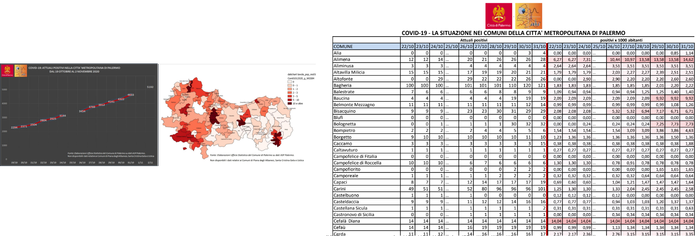

# Casi Positivi di COVID-19 Comuni Sicilia

<!-- TOC -->

- [Casi Positivi di COVID-19 Comuni Sicilia](#casi-positivi-di-covid-19-comuni-sicilia)
  - [Introduzione](#introduzione)
  - [Perché questo repository](#perché-questo-repository)
  - [Struttura repository](#struttura-repository)
  - [File CSV](#file-csv)
  - [Struttura file CSV](#struttura-file-csv)

<!-- /TOC -->

## Introduzione

La  _**Protezione Civile di Palermo**_ a partire dal 28/ottobre/2020,  rende disponibile, nel [Canale Telegram](https://t.me/ProtezioneCivilePalermo), il seguente link `http://tiny.cc/CovidPalermo_27Ott` dove è possibile raggiungere un **PDF** _**COVID-19: LA SITUAZIONE NEI COMUNI DELLA CITTÀ METROPOLITANA DI PALERMO**_:



## Perché questo repository

Come detto nell'introduzione, la _**Protezione Civile di Palermo**_ fornisce solo i **PDF**, in questo repository li raccoglieremo, estrarremo e ristruttureremo i dati per renderli usufruibili in forma di testo strutturato, i classici file **CSV**.

## Struttura repository

La struttura di base è divisa per codice ISTAT Comune (082053 Città Metropolitana di Palermo). E poi all'interno è suddivisa in _dati grezzi_ e _output_.

```
covidComuniSiclia/
│
├── 082053/
│   ├── output/
|       ├── 20201026-Covid_PA.csv
|       ├── 20201102-Covid_PA.csv
|   ├── rawdata/
|       ├── 20201026-Covid_PA_20201026.pdf
|       ├── 20201102-Covid_PA_201102.pdf
|   ├── script/
|       ├── 20201102.sh
|       ├── tabula-20201102-Covid_PA_201102.sh
├── imgs/
├── risorse/
|   ├── codidciIstatComuni.csv
```

## File CSV

nome file | esempio | formato file | Codifica | separatore
----------|---------|--------------|----------|-----------
YYYYMMDD-Covid_PA|20201026-Covid_PA.csv| CSV  | UTF-8 | `,`

## Struttura file CSV

nome campo    | descrizione | formato | esempio
--------------|-------------|---------|-------
_CodiceISTAT_   | Codice ISTAT | numerico (5) | 82001
_COMUNE_        | Denominazione Comune | Testo (var) | Alia
_data_          | Data| YYYY-MM-DD | 2020-10-19
_positivi_      | Numero di Positivi | numerico (var) | 3

--

**Fonte:** Elaborazioni Ufficio Statistica del Comune di Palermo su dati ASP Palermo
